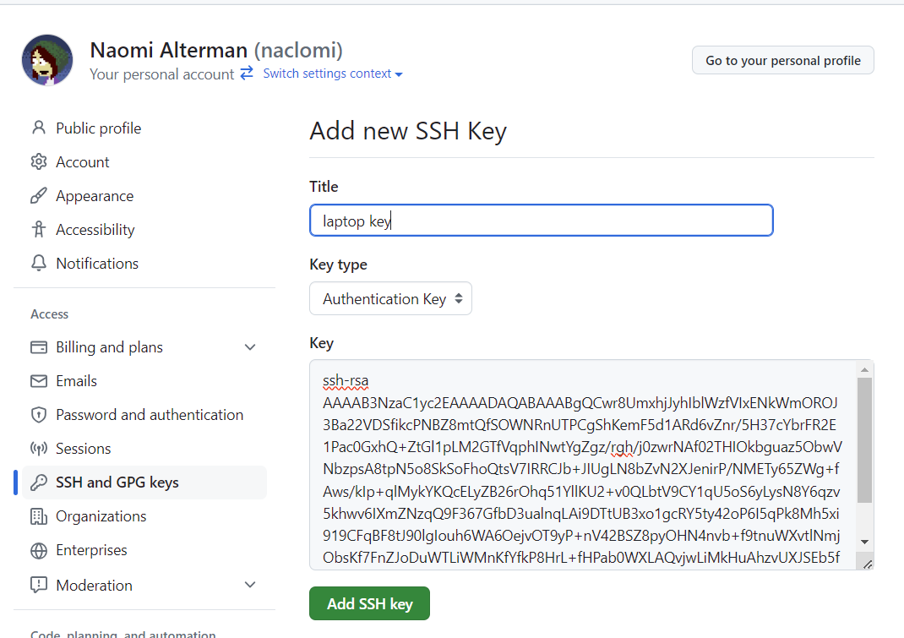
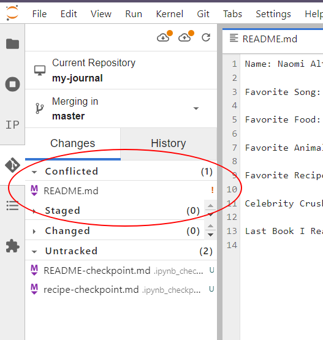

# Introduction

In this tutorial, we'll learn how to back up the repo we made in the [solo workflow tutorial](../solo-jupyterlab) to the cloud. This backup will _include_ the file change histories. Because that backup lives in the cloud, you can technically download it to multiple computers (or multiple locations on your current computer). We'll also learn how to keep the timelines consistent across all of those copies, in case we add content to one of them. 

# Making a GitHub account

{}
✋ If you already have a GitHub account, you can [skip this section](#acct-end)
{}

Follow this link to create a new GitHub account:

{}
🔗 https://github.com/signup
{}

<a id="acct-end"></a>

# Setting up account credentials


Click your user icon in the top right:


Choose settings:


Choose `SSH and GPG Keys` from the menu on the left (1):


{}
✋ If you already have SSH keys listed on this page in your GitHub account, you can [skip the remainder of this section](#key-end)
{}

Click the green `New SSH Key` button (2), and then go back to your JupyterHub window.

Click the + button (1) and then open a new Terminal (2):


From the terminal, run the following command:

```bash
ssh-keygen
```

Hit the enter key to accept the default values for the questions the tool asks you. **Do not specify a passphrase!!** Just leave it blank :) .

This process will generate an **SSH key**, which is like a super-powered password that comes in two parts: a _private_ key and a _public_ key. You'll share the public key with GitHub. Run this command, which prints the contents of your public key to the terminal:

```bash
cat ~/.ssh/id_rsa.pub
```

It'll look...well..._incomprehensible_. That's a good thing! We'll never be typing it in ourselves. Select and copy all of the command output (starting with the text `ssh-rsa` and extending all the way down to the blank line).

Now, go back to your web browser that was open to GitHub's "Add SSH Key" page and paste the contents into the "Key" box. Give the key indicating which computer you generated it on, and click the green "Add" button:



Now to test that everything works, go back to your terminal and run the following command:

```bash
ssh -T git@github.com
```

If you see a warning printed like the text below, just type `yes` and hit enter to continue:

```plaintext
The authenticity of host 'github.com (IP ADDRESS)' can't be established.
ED25519 key fingerprint is SHA256:+DiY3wvvV6TuJJhbpZisF/zLDA0zPMSvHdkr4UvCOqU.
Are you sure you want to continue connecting (yes/no)?
```

Regardless, if things were successful, you'll see a message like this:

```plaintext
Hi [USERNAME]! You've successfully authenticated,
but GitHub does not provide shell access.
```

If you _don't_ see that message, ask for help before you move on.

{}
ℹ️ In general, we need to repeat this process on any new computer we're using to connect to Github. You can add as many SSH keys as you want to your account.
{}

<a id="key-end"></a>

# Connecting our JupyterHub repo to our GitHub account

We need to start by making an empty repository on GitHub's website, which we'll soon fill with all of our work from the solo workflow.

From anywhere on GitHub's website, click the plus button at the top-right (1) and select 'New Repository' (2):


From here, you'll be able to select some options for how your repository will be stored. Make the following choices:

- (1) Give the repo the same name as the folder you made in the solo workflow. The two don't _have_ to have the same name, but if they don't it's easy to lose track of which folder on your computer is connected to this cloud backup. 
- (2) Select _Private_ for the repo's visibiltiy. This controls whether the cloud version of the repository will be visible to everyone on the internet, or _just_ to yourself (and any GitHub users you explicitly choose).
- Leave everything else on the page exactly the same

Scroll down and click the green "Create" button:


You'll be brought to your new repository's **landing page**:


Now we need to connect our computer's repository (the "local" copy) with this repository (the "remote" copy). This process is called "**adding a remote**". Start by copying the SSH url of the repository on the landing page, as circled on the right below:


The thing you're copying should start with the text `git@github.com`. If it doesn't, try clicking the `SSH` button as circled on the left first, and then copying the text.

Now let's go back to JupyterHub. Open the Git menu at the top (1) and select "Manage Remote Repositories" (2):


Enter the name "**origin**" (1), which by convention is the name we use for the primary copy of our repo that lives in the cloud. Then, in the next box, paste in the text we copied from GitHub (2). Click Add (3):


The remote should appear in the list below the Add button. Click the `X` on the "Manage Remotes" window to return to our workspace.

Finally, open the git menu again and click "Push to remote":


After a minute, we should see a success message show up in the bottom right of the window. Go back to your repo's landing page on GitHub, and refresh the page. You should see your files there!


Congratulations, your hard work is backed up to the cloud 🙂 .

# Keeping things synced

Let's open up the `readme.txt` on our JupyterHub and add another fact about ourselves to the bottom:

```plaintext
Celebrity Crush: Katya Zamolodchikova
```

Commit this change to the repo in JupyterHub and go back to the remote repo on GitHub. Refresh the page:


...the change didn't show up. It turns out different copies of the repository don't stay in sync automatically. We always have to manually choose to sync them.

{}

**⚠️⚠️This is an important point⚠️⚠️⚠️**

It's so important, let's repeat it: Changes we make on our local repo won't be reflected on the remote copy until we _push_ them to that copy.

{}

This is behavior is really useful! If we screw something up on our local repository, it won't automatically screw up the cloud backup. We could just delete the folder from our computer and download the whole thing again from Git (we'll do that soon in the collaborative workflow).

Anyway, let's push our local changes. Click the push button (the up arrow) in the top of the Git sidebar:


Now go back to GitHub and refresh the page. We should now see our recent changes appear:


But wait, what if we change something on the _GitHub_ copy? (...can we do that?)

We might have noticed that the preview text in the README isn't formatted nicely. If we add an extra blank line between each fact about ourselves, things should look nicer. Click the little pencil icon on the top-right of the README box:


Add an extra blank line between each of our facts, and then click `Commit changes...` (2):


GitHub will ask you for a commit message. Enter something in the description box, leave the rest of the settings as-is and click the green "Commit" button:


Go back to the repo's landing page with the `<> Code` button at the top:


We'll see our latest commit reflect on the landing page, and the formatting should be corrected. But now let's go back to JupyterHub. Things are just as we left them before our GitHub edits:


To get those changes on our local repo, we have to **pull** them (the opposite of a push!). Click the button with the _down_ arrow (the pull button), right next to the push button we've already used:


We'll see our new commits appear in the timeline:


# What if we change something on both GitHub _and_ locally?

This is beginning to get into where Git both shines as a power tool and also gets _difficult_ to use. Let's jump into it together.

Before we get started, let's set a Git option regarding how to deal with conflicting changes. We'll only have to do this once. Open a terminal using the Git menu and selecting "Open Git Repository in Terminal". In the terminal that opens, run this command. It should complete without presenting any output:

```bash
git config pull.rebase false
```

Now make a commit on GitHub changing `readme.txt`, and make a _different_ change/commit to local `readme.txt`. Add your favorite color to `readme.txt` using GitHub, and add the name of the most recent book you read on JupyterHub. Make sure to commit the changes in both places.


Then click the "pull" button in JupyterHub. An error will appear in the bottom right explaining that the pull failed, and looking in the "Changes" tab we'll see that README.md now appears in the _Conflicted_ list!



So, what happened?

We can get a visualization by running a complicated-looking terminal command whose sole job is just to print a little picture of our commit history. Open a new terminal by clicking the Git menu and selecting "Open Git Repository in Terminal," and then run this:

```bash
git log --all --decorate --oneline --graph
```

We'll see a crude drawing of a timeline printed out to the screen that looks like this:


Look at the top where the red lines appear. This is telling us that the repo's main timeline has _diverged_ into two branches 😱🙀🤯

On the one hand, we have our "normal" `master` branch showing the commit we made through Sublime Merge (adding the book we read). On the other branch, labeled `origin/master`, we have the commit from GitHub (adding our favorite color).

Sometimes Git can figure out how to resolve these discrepancies and merge the timelines, but it often runs into situations where it would rather ask _you_ to do so manually (so it doesn't accidentally make changes you'd disagree with). In this case, Git is asking us about that file in the "Conflicts" list we saw earlier.

This is a common problem to encounter, and very worth our while to get experience dealing with! Whenever we encounter a conflict, we need to open the conflicted file in a text editor and _fix_ the conflicted portions of it. Those portions are labelled with a specific notation:

```python
<<<<<<< VERSION 1 LABEL
version 1 of the conflicting text
=======
version 2 of the conflicting text
>>>>>>> VERSION 2 LABEL
```

Wherever these angle brackets `<<<<<<< ... >>>>>>>` appear, they indicate two different versions of the same section of text, separated by the `=======`. Git couldn't choose between them, so it wants us to replace this conflicting section, including the angle brackets `<<<<<<< ... >>>>>>>`, with the version _we_ want. Maybe this is the top version. Maybe it's the bottom. Maybe it's some clever combination of the two.

So let's open up `README.md` and take a look. Open the Files tab (1) and select README.md (2). We should see a conflict at the bottom (3):


The way Git sees it: in two parallel universes, we edited our file and added a fact to the end. In one univese, it was a book name. In the other, it was a favorite color. Git doesn't know which version of events we would choose as the authoritative one. Actually, we choose neither -- we want a universe in which we added _both_ facts to the bottom of the file. So, let's replace the `<<<<<<< ... >>>>>>>` brackets and everything between them with the lines we want to keep:


Save the file, then open up the Git sidebar (1). Double-click the conflicted file we just fixed (2), and click "Mark as resolved" (3):


You'll see the file move from "Conflicted" to "Staged" in the sidebar. Git would like to memorialize our resolution of the timeline with a commit that unifies the two branches. This is called a _branch merge_. Seal the deal by writing a commit message and hitting the commit button.

If you go back to the terminal and run that branch viewer command again, you should see a drawing of a timeline that splits into two branches and then merges again. Time crisis averted. Hooray!


At this point, the timelines have been resolved on your local repo, but the remote copy is still lacking your local changes. Click the "push" button to push your changes to GitHub:


Congratulations, you just dealt with the most common difficult problem you'll encounter while using Git. Hopefully that wasn't so bad! Regardless, you will be come more comfortable with it with practice 🙂.

