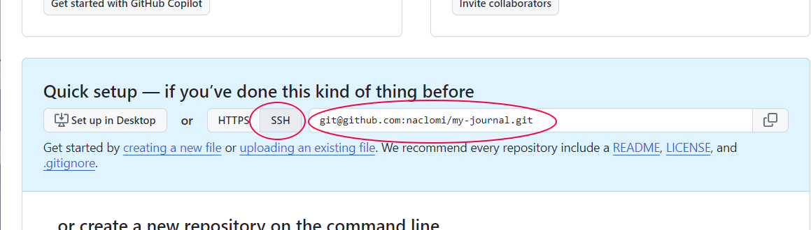
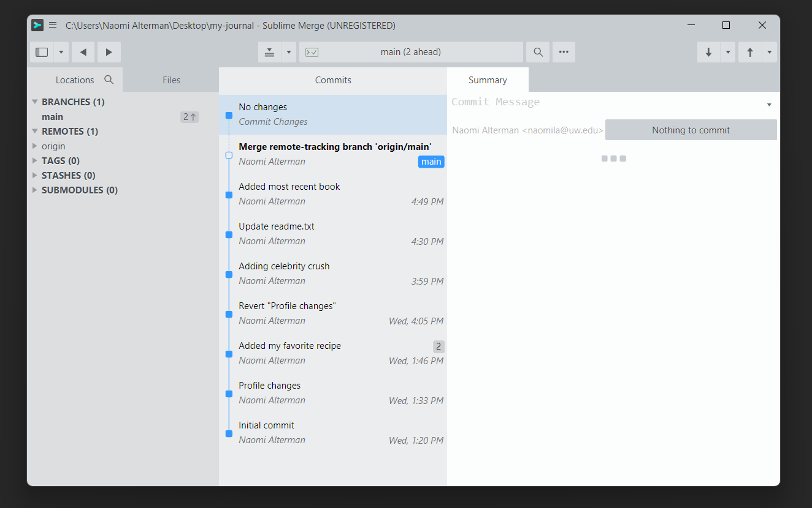

# Introduction

In this tutorial, we'll learn how to back up the repo we made in the [solo workflow tutorial](../solo) to the cloud. This backup will _include_ the file change histories. Because that backup lives in the cloud, you can technically download it to multiple computers (or multiple locations on your current computer). We'll also learn how to keep the timelines consistent across all of those copies, in case we add content to one of them. 

# Making a GitHub account

{}
✋ If you already have a GitHub account, you can [skip this section](#acct-end)
{}

Follow this link to create a new GitHub account:

{}
🔗 https://github.com/signup
{}

<a id="acct-end"></a>

# Setting up account credentials


Click user icon:


Choose settings:


Choose `SSH and GPG Keys` from the menu on the left (1):


{}
✋ If you already have SSH keys listed on this page in your GitHub account, you can [skip the remainder of this section](#key-end)
{}

Click the green `New SSH Key` button (2), and then minimize your web browser.

Open your computer's terminal application -- on Windows with WSL it will be called `Ubuntu`. On MacOS, it's just called `Terminal`. From the terminal, run the following command:

```bash
ssh-keygen
```

Hit the enter key to accept the default values for the questions the tool asks you. This will generate an **SSH key**, which is like a super-powered password that comes in two parts: a _private_ key and a _public_ key. You'll share the public key with GitHub. Run this command, which prints the contents of your public key to the terminal:

```bash
cat ~/.ssh/id_rsa.pub
```

It'll look...well..._incomprehensible_. That's a good thing! We'll never be typing it in ourselves. Select and copy all of the command output (starting with the text `ssh-rsa` and extending all the way down to the blank line).

Now, go back to your web browser that was open to GitHub's "Add SSH Key" page and paste the contents into the "Key" box. Give the key indicating which computer you generated it on, and click the green "Add" button:


Now to test that everything works, go back to your terminal and run the following command:

```bash
ssh -T git@github.com
```

If you see a warning printed like the text below, just type `yes` and hit enter to continue:

```plaintext
The authenticity of host 'github.com (IP ADDRESS)' can't be established.
ED25519 key fingerprint is SHA256:+DiY3wvvV6TuJJhbpZisF/zLDA0zPMSvHdkr4UvCOqU.
Are you sure you want to continue connecting (yes/no)?
```

Regardless, if things were successful, you'll see a message like this:

```plaintext
Hi [USERNAME]! You've successfully authenticated,
but GitHub does not provide shell access.
```

If you _don't_ see that message, ask for help before you move on.

{}
ℹ️ In general, we need to repeat this process on any new computer we're using to connect to Github. You can add as many SSH keys as you want to your account.
{}

<a id="key-end"></a>

# Backing our repo up to our GitHub account

We need to start by making an empty repository on GitHub's website, which we'll soon fill with all of our work from the solo workflow.

From anywhere on GitHub's website, click the plus button at the top-right (1) and select 'New Repository' (2):


From here, you'll be able to select some options for how your repository will be stored. Make the following choices:

- (1) Give the repo the same name as the folder you made in the solo workflow. The two don't _have_ to have the same name, but if they don't it's easy to lose track of which folder on your computer is connected to this cloud backup. 
- (2) Select _Private_ for the repo's visibiltiy. This controls whether the cloud version of the repository will be visible to everyone on the internet, or _just_ to yourself (and any GitHub users you explicitly choose).
- Leave everything else on the page exactly the same

Scroll down and click the green "Create" button:


You'll be brought to your new repository's **landing page**:


Now we need to connect our computer's repository (the "local" copy) with this repository (the "remote" copy). This process is called "**adding a remote**". Start by copying the SSH url of the repository on the landing page, as circled on the right below:



The thing you're copying should start with the text `git@github.com`. If it doesn't, try clicking the `SSH` button as circled on the left first, and then copying the text.

Now let's go over to Sublime Merge. Click the "Push" button in the top-right, which is generally used to back up all of the commits on your personal computer to the cloud copy of the repository. It looks like an up arrow:


Because we haven't connected our computer's "my-journal" repo to the GitHub "my-journal" repo yet, Sublime Merge will ask us a few questions. It'll start with the name of the remote. Enter the name "**origin**", which by convention is the name we use for the primary copy of our repo that lives in the cloud. Type "origin" and hit enter:


Next, it'll ask for origin's url. This is the text we copied from GitHub. Paste it into the prompt and hit enter:


Now things should be all connected up. Click the push button again:


After a minute, we should see a success message like this show up:


Go back to your repo's landing page on GitHub, and refresh the page. You should see your files there!


Congratulations, your hard work is backed up to the cloud 🙂 .

# Keeping things synced

Let's open up the `readme.txt` on our computer and add another fact about ourselves to the bottom:

```plaintext
Celebrity Crush: Katya Zamolodchikova
```

Commit this change to your local repo:


Now let's go back to the remote repo on GitHub and refresh the page:


...the change didn't show up. It turns out different copies of the repository don't stay in sync automatically. We always have to manually choose to sync them.

{}

**⚠️⚠️This is an important point⚠️⚠️⚠️**

It's so important, let's repeat it: Changes we make on our local repo won't be reflected on the remote copy until we _push_ them to that copy.

{}

This is behavior is really useful! If we screw something up on our local repository, it won't automatically screw up the cloud backup. We could just delete the folder from our computer and download the whole thing again from Git (we'll do that soon in the collaborative workflow).

Anyway, let's push our local changes. Click the push button (the up arrow) in the top-right of Sublime Merge again, and then refresh the page. We should now see our recent changes appear:


But wait, what if we change something on the _GitHub_ copy? (...can we do that?)

Click the little pencil icon on the top-right of the README box:


Add another fun fact about yourself (1) to the readme.txt file and click `Commit changes...` (2):


GitHub will ask you for a commit message. Enter something in the description box, leave the rest of the settings as-is and click the green "Commit" button:


Go back to the repo's landing page with the `<> Code` button at the top:


We'll see our latest commit reflect on the landing page. But now let's go back to Sublime Merge. Things are just as we left them before our GitHub edits:


To get those changes on our local repo, we have to **pull** them (the opposite of a push!). Click the button with the _down_ arrow (the pull button), right next to the push button we've already used:


We'll see our new commits appear in the timeline:


# What if we change something on both GitHub _and_ locally?

This is beginning to get into where Git both shines as a power tool and also gets _difficult_ to use. Let's jump into it together.

Make a commit on GitHub changing `readme.txt`, and make a _different_ change/commit to local `readme.txt`. Add your favorite color to `readme.txt` using GitHub, and add the name of the most recent book you read using your local text editor and Sublime Merge. Make sure to commit the changes in both places.


Then click the "pull" button in Sublime Merge.

You'll see an orange bar appear and an interesting thing happen to the commit timeline:


The commit log shows us that the repo's main timeline has _diverged_ into two branches 😱🙀🤯

On the one hand, we have our "normal" `main` branch showing the commit we made through Sublime Merge (adding the book we read). On the other branch, labeled `origin/main`, we have the commit from GitHub (adding our favorite color). Sublime Merge presents us with four options:
1. **Merge** - This will accept that the timelines briefly diverged, and add a new commit that "merges" them back into one authoritative timeline. This is the proper way to deal with the divergence.
2. **Rebase** - This will _rewrite_ the timeline attempting to put things in chronological order as if the commits were all originally made on the local repo. Because this alters history, we try to _avoid_ this option.
3. **Hard Reset** - This will throw the local commits away entirely, and just make our local repo's timeline look like GitHub's timeline. We don't want to throw away our hard work this time, so we'll go with Merge instead.
4. **Hide** - This allows `main` and `origin/main` to remain diverged, and any changes we make on either timeline branch will leave the other unaffected. We _really_ don't want this.

Click **Merge**, and you'll be presented with some options:


Leave everything as is, and click the green 'Merge' button.

We're almost done, but there is a conflict between versions of the file that Git doesn't know how to resolve:


We can resolve this conflict exactly the same way we resolved the conflict during the _revert_ process of the solo workflow tutorial. Go into your text editor and fix the conflicted region:


Now go back into Sublime Merge, stage the changes, and click the "Commit" button to finish the merge:



At this point, the timelines have been resolved on your local repo, but the remote copy is still lacking your local changes. Click the "push" button to push your changes to GitHub:


Congratulations, you just dealt with the most common difficult problem you'll encounter while using Git. Hopefully that wasn't so bad! Regardless, you will be come more comfortable with it with practice 🙂.

