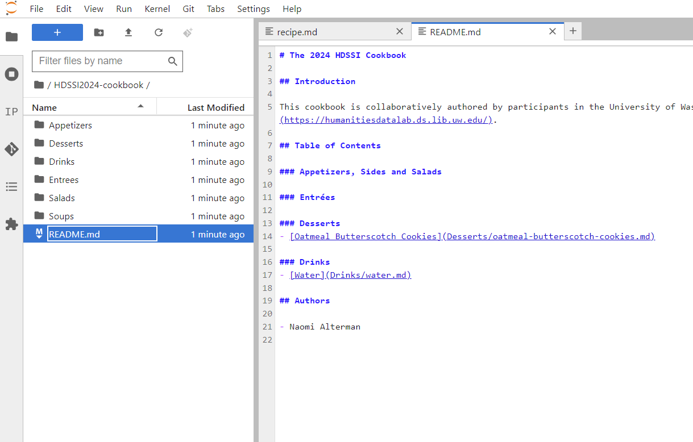
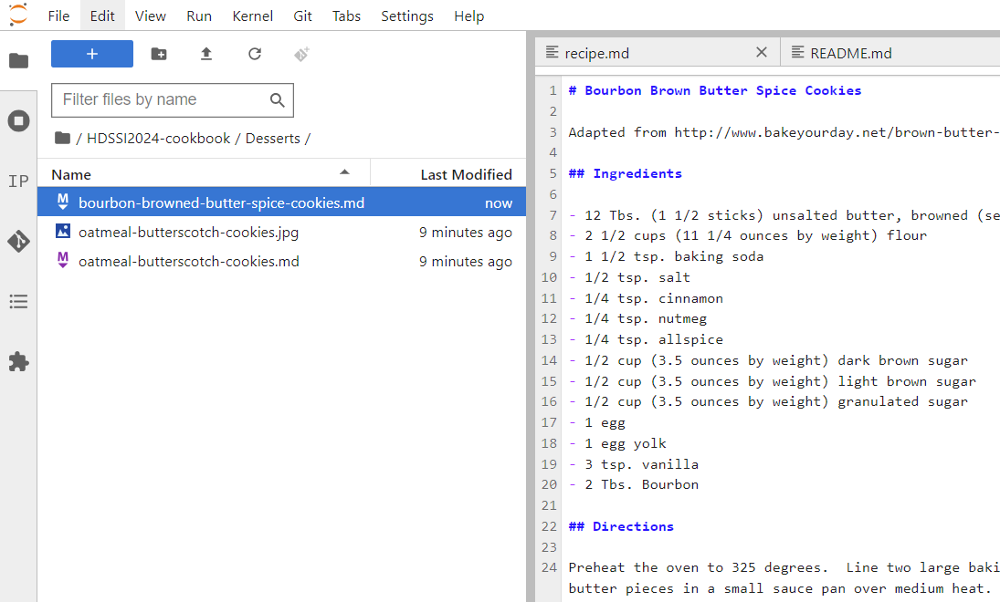

# Introduction

In this workflow, we'll all be working on the same repository at once. In this case, the repository is a **cookbook** that we're each going to add our favorite recipe to. Rather than using the cloud copy of repo as a backup, we'll use it as the "**true**" copy of the cookbook. The local copies on all of our computers will become the "**working**" copies. In git terminology, the true copy is the "**upstream**" repo and our copies are the "**downstream**" repos, because changes in the _upstream_ will flow all the way _downstream_. These distinctions are just conceptual -- Git doesn't distinguish between what different copies of a repo mean. It's all just in our minds 🤯.

# Getting a copy of the repository

Let's take a look at the landing page of our cookbook repo:

{}
🔗 {}
{}

It's not too different from our solo workflow -- a repo filled with text files. In this case, the readme file `README.md` contains the cookbook's table of contents, and the recipes are organized into categorical folders.

Let's download a working copy of this repo. This is called *cloning*. To clone the repo, start by clicking the green `<> Code` button (1). Make sure "SSH" is selected (2), and then copy the ssh url below (3):

Head over to JupyterHub and go back to your home folder. Do this by selecting the Files sidebar (1) and then clicking the little folder icon right above the file list (2):

From here, we can clone a copy of the cookbook repo. Click the Git Clone button, which is in the list of icons at the top of the files sidebar:

Paste the ssh url into the text box and click the "Clone" button:

{}
ℹ️ By default, the cloned repo's name will be the same as the upstream repo name. We could rename it to whatever we wanted, though -- this is useful if we want to clone multiple copies of the same repo for different purposes.
{}

After a couple of seconds, Git should succesfully download all the cookbook files into a folder with the repo name:

Let's double-click that folder and confirm all our cookbook files are there:

If this were a solo workflow, we'd be all ready to add our recipe. But because we're sharing this repo with others, we've gotta be careful!

# The workflow

Recall during the "backups" tutorial how much trouble we got into when the repo's GitHub copy and local copy had different changes. This is _guaranteed_ to happen when multiple people are working on the same repo. So, rather that letting the main timeline naturally diverge multiple times (which would be very confusing and difficult to resolve!), we're going to **intentionally** create a branched version of the timeline (generally just called a "**branch**").

The current branch that we're viewing in the file explorer is called the **checked out branch**. This is the same terminology we were using in the solo workflow to describe checking out a commit. Let's update that definition:

{}

📖 **"Check out"** - _verb_
- **To "check out a branch" means to make all files in the repo reflect the most recent commit of a branch's version of the timeline. All future commits will be to this version of the branched timeline.**
- To "check out a commit" means to make all files in the repo reflect their contents at that commit's point in the timeline.
- To "check out a file" usually means to return a file to its present-day contents

{}

Anyway, here's the workflow of exactly how we're going to use branches:

1. We clone the shared repo to our computer
2. If we're just using our repo's contents, say to look up a recipe, we use the main timeline
3. If we want to __change__ something, we create a new **branch** and check it out. We'll call this our **working branch**.
4. We make our changes and commit them. That commit goes to the HEAD of the checked out branch
5. We push our branch to origin (that is, we back up our branch to the cloud)
6. We use GitHub's website to merge that branch back into the main timeline. Our changes are now "upstream".
7. Everyone else pulls our upstream changes to their local repos.
8. They merge main into their working branches.

# Branching the timeline

So let's open the Git sidebar (1), expand the list of timeline branches in the repo (2) and click the "New Branch" button (3):

We'll be asked to give the branch a name. We can name it whatever we want, with a few rules:
- Let's stick to letters, numbers, forward-slashes `/`, dashes `-`, and underscores `_`. Critically, **no spaces**
- Because we're collaborating with others, let's **start** the branch name **with our own name** (or username). Separate that from the rest with a slash `/`
- Make it descriptive about what we're intending to work on. For example, `my-name/new-soup-recipe`, rather than `my-name/work`.

In Naomi's case, she's adding a new cookie recipe. Type out your branch name and leave the rest of the options as-is. Click "Create Branch":

Our branch will get created and automatically checked out. Let's notice a few things about the Git sidebar now:

1. The name of the currently checked-out branch is listed in the Git sidebar as "Current Branch" (it's also listed in the status bar at the bottom of the screen). New commits we make will be added to _this_ branch of the timeline
2. Our branch is now in the branch list on the left. We can use this list to _switch_ the checked out branch at any point.
3. We can see there's a label with our branch name in the commit list. This indicates where the _head_ of the branch is (which is to say, the most recent commit on the branch).
    - Notice that we can see multiple branches are currently headed at the initial commit: our branch, and also main. That's because we haven't changed anything yet, so the branch timelines haven't diverged.

Anyway, let's get working. Go to the appropriate folder in the repo and add a new text file containing your recipe:

Also open the readme.md file and:
- Add your recipe to the table of contents, following the pattern of the other entries (recipe name in square brackets, followed by the filename of the recipe's text file in parentheses)
- Add your name to the authors list at the bottom

Finally, commit the changes with a descriptive commit message. Be sure to stage **both** the **readme changes** and also **the recipe's text file**. **We have to click the stage buttons for both**. If we miss one, we'll have to make another follow-up commit.

Note the timeline now: the labels are in different places. Something _new_ has happened on the `new-cookie-recipe` timeline: we've added our recipe in a new commit. The timelines have diverged, and our branch is **ahead** of main:

Let's push our branch to GitHub, so the cloud copy of the repo has both the main timeline and our working copy's timeline. Click the push button:

The timeline labels change again! Now there is a new one:

There is the new-recipe branch on our computer (the blue label), and the backed-up copy of the timeline in the cloud (the grey label that stars with `origin/`).

Let's go over to the repo's landing page on GitHub and hit the refresh button. Note the yellow notification box mentioning our branch:

If you click the little box that says "main" beneath that, you can see a list of branches on the remote repo. It now includes ours:

Neato.

How to do we merge these changes into the main timeline, though?

# Merging the timelines with pull requests

In general, the process of combining one branch's commits into another is called merging. Both branches remain in existence. The branch we're merging _from_ remains completely unchanged. The branch we're merging _into_ gains the changes from all the commits on the from-branch.

We can merge branches in JupyterHub. In general, we will. But the `main` branch is special. Because the main branch on GitHub is the one "true" source of our files across all collaborators, we want to only change it _on_ GitHub. That's instead of changing main on our local copy, and pushing those changes to GitHub.

This process of changing main directly on the origin copy of the repo is called a **pull request** ("PR"), because we're _requesting_ that the collaborative group "accepts" our changes and "pulls" them into main. Here's the process:
1. We make a new branch and add commits to it.
2. We push our branch to origin
3. We **issue a PR** requesting that our branch gets merged into main
4. The group reviews the changes this would make using GitHub's website
5. If unsatisfied with those changes, we can add new commits to the branch and they'll show up in the PR.
6. Once we're all satisfied, the group verbally approves the PR.
7. One of the approvers clicks the "Merge" button. The main timeline now includes our changes.

Okay! Let's do it!

We could use the yellow notification box on GitHub to issue our PR, but after awhile that notification box might disappear. Here's a consistent way to start a PR on GitHub:

Switch to the branch we want to merge into main. In the screenshot below, it's the "new cookie" branch. On your computer, though, it'll be _your_ branch that you want to click:

GitHub will let us know how this branch relates to `main` in terms of how many commits ahead (or behind) it is. Click the `Contribute` button (1), and then click `Open pull request` (2):

From here, we'll get a chance to write a description of our changes. Put something informative, as this will help our team members understand the changes they are reviewing:

Note that, on the right, you can also click `Reviewers` to tag the GitHub accounts of teammates you want to look at your changes. You can even **assign** someone to it under the Assignees box. The assignees are generally responsible for hitting the merge button once everyone is happy with your changes.

Click the green Create button. The PR will get issued, and you can share the page's link from the browser's URL box with your teammates so they can take a look. On the PR page, you can click the `Commits` tab to view the commit timeline that this PR will merge into main. You can click the `Files changed` tab to view the _actual content_ that will be added to the repo's files. You can have a discussion with your teammates on the `Conversation` tab, like a discussion in the comments on an Instagram post:

Once everyone is happy with the changes, have a reviewer click the `Merge` button. Click the "Confirm" button to seal the deal.

{}
🔍🤷‍♀️**What if there is no green merge button?**

Check out the discussion [below](#resolve-merge)
{}

{}
✋⚠️**Note that you can't undo a merge!!**⚠️✋

As long as your branches are _unmerged_ you can add commits to your working branch, or even delete the working branch and start again from scratch. As soon as you merge to the main timeline, though, your changes are "real" and everyone will eventually have to include them in their own work.
{}

Once our working branch is merged, we'll have the opportunity to delete it. This is because the branch is no longer "needed" -- its commits exist in the main timeline, and if we do work in the future it should be on a _new_ branch that starts from the _new_ most recent head of main. Go ahead and click "delete":

# Dealing with merge conflicts

{}
🔍🤷‍♀️**What if I didn't have trouble merging my PR?**

Read anyway! You will some day!!
{}

If someone else had their PR merged before ours, GitHub might not let us merge the PR just yet. We'll see something like this:

What's happening is a _merge conflcit_, just like the ones we encountered when pushing/pulling in the backups lesson and when reverting content in the solo workflow lesson. Click the "Resolve conflicts" button, which will open a text editor in GitHub that lets us step through the conflicted files and fix them just as we did in JupyterHub in the previous tutorial chapter.

# Wrapping up

Once you've merged a PR, pull the most recent version of the main timeline down to your local repo. Have your collaborators do this too, to get your recipe!

Start by checking out the main branch by double-clicking it in the branch list:

And then hit the pull button:

We'll now see that our main timeline contains the changes from all the recipe PRs that have been merged thus far:

And that's the process! It may feel complicated this first time, but it's a battle-tested workflow used across the world to collaboratively work on computer code. In time it will become second nature. And before then, you have plenty of Git mentors around you who would love to help should you get stuck :) .