# Introduction

In this tutorial, we'll learn how to use Git to keep track of changes to text files over time. The steps presented here represent just _one_ way to use Git -- a **solo** workflow, in which the files live on your personal computer and are never intended to be shared with or edited by other people.

# Setting up a lil journal

Make a new folder in the home folder of your JupyterHub called `my-journal`, and inside it make a new text file called `README.md`. 

Type out some info about yourself, like this:

```bash
Name: Naomi Alterman
Favorite Food: Pizza
Favorite Animal: Bunnies
```

Save that file as `README.md` in your `my-journal` folder.

At this point our `my-journal` folder is just a normal file folder, with normal files. Let's turn it into a git repository so we can track changes to those files over time!

# Turning our journal folder into a repository

Open the Git tab on the side of the JupyterHub (1) and click New Repository (2). Confirm in the window pops up that, yes, we want to turn the folder into a repo:

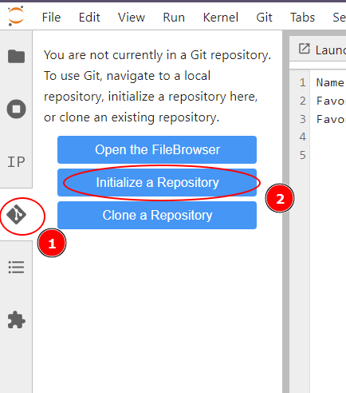

The folder `my-journal` will now be turned into a git repo, and present a sidebar that looks like this:

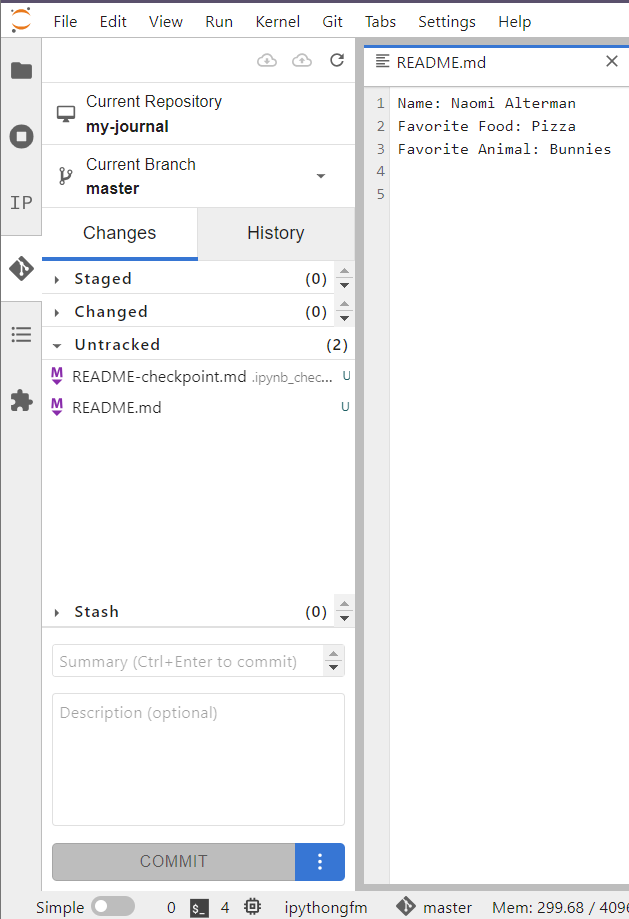

From here, we'll be able to see changes to files that haven't yet been committed to the Git timeline. By we'll collect those changes up on to the commit *stage*, and then *make the commit* to record them into the repo's history!

# Making our first commit

Let's make our first commit, in which we'll mark the initial version of our user profile.

We'll start by **staging** the changes, which indicates to Git that we want to _include_ them in the next commit. Expand the list of "Untracked Files". Move your mouse over `README.md` and click the plus button `+` to stage the file to be tracked by Git:

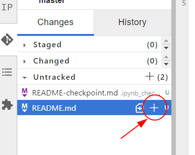

The file will move to the *Staged* list, indicating its changes are ready to be recorded in the historical timeline. Move your mouse over the file again and click the button with the `+/-` symbols on it to view the file's "diff":

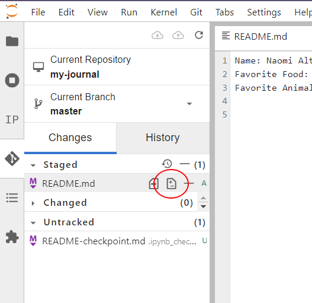


 Note how this displays the contents of the file in green: the "diff" view of the file shows the changes (the "_diff_"erences) since the last commit of the timeline. Since it's a new file, and this is our first commit, all of the file text is new and thus highlighted in green:

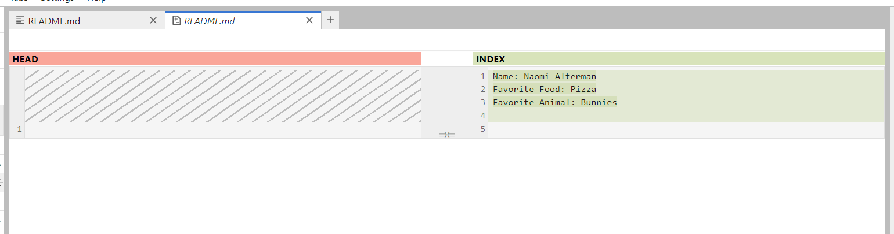

Let's commit the changes now :) . In the bottom left of the window, enter a brief summary of the changes (1) and hit the blue COMMIT button (2):

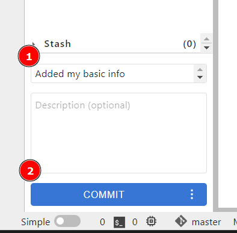

{}

**ℹ️ Heads up!**

The first time you do this, you may be asked to provide your name and email address to be noted in the commit log. If the repo was ever made publically available this personal info would be visible as well, so please keep this in mind (especially when entering an email address). You don't have to put your _actual_ information here if you don't want to.

{}

Once you're finished, you'll see the readme file disappear entirely from this sidebar. That indicates that the readme has had no changes to its content since the last commit.

That said, the information about file history is all still there! Click the History tab (1) to view all previous commits to the repository. Note the commit we just made is visible now (2). Click it to display what changes were recorded at that point in time. In this case, it's our README file (3). From here we can open a diff of the file, or see a summary about what was changed:

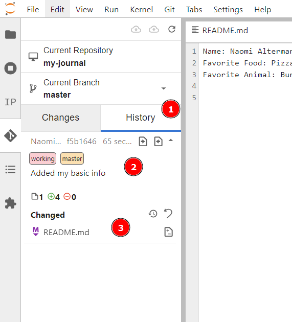

Also notice the gibberish numbers in the summary after the committer's name (circled below in red). This is called the **commit hash**: it's a string of letters and numbers that serve as a unique name for this commit (that is, this set of changes to our files). Git tools (and git users) will often use commit hashes as "names" for specific points in the timeline. Insetad of including _all_ of the hash, it's often sufficient to just include 6 or 7 characters from the beginning (left side) of the hash. For example, the selected commit in the screenshot could be referred to as `commit f5b16`.

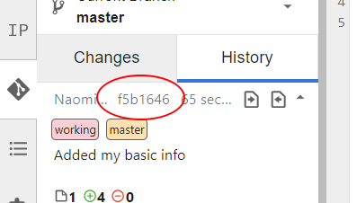

# Using commits to record changes

Let's change our profile. Go over to your text file and make a few changes:
- Add a new line in the middle of the file and specify your favorite song. 
- Replace your favorite animal's name with its taxonomic name (you may have to google it)


My profile now looks like this:

```bash
Name: Naomi Alterman
Favorite Song: "Under Pressure" by Queen
Favorite Food: Pizza
Favorite Animal: Oryctolagus cuniculus
```

Save the file and then open the "Changes" tab on the git sidebar. Click the diff button on our README.md file to see your changes represented as a diff:

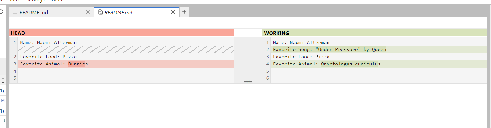

In the sidebar, click the '+' button next to README.md to stage the changes for commit. Then type a message out and commit the changes. Now we'll have two commits in our history:

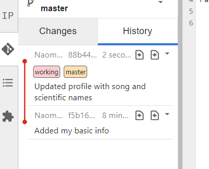

Let's make another commit! Make a new text file file in your journal folder and save it as `recipe.md`. Paste your favorite recipe into it:

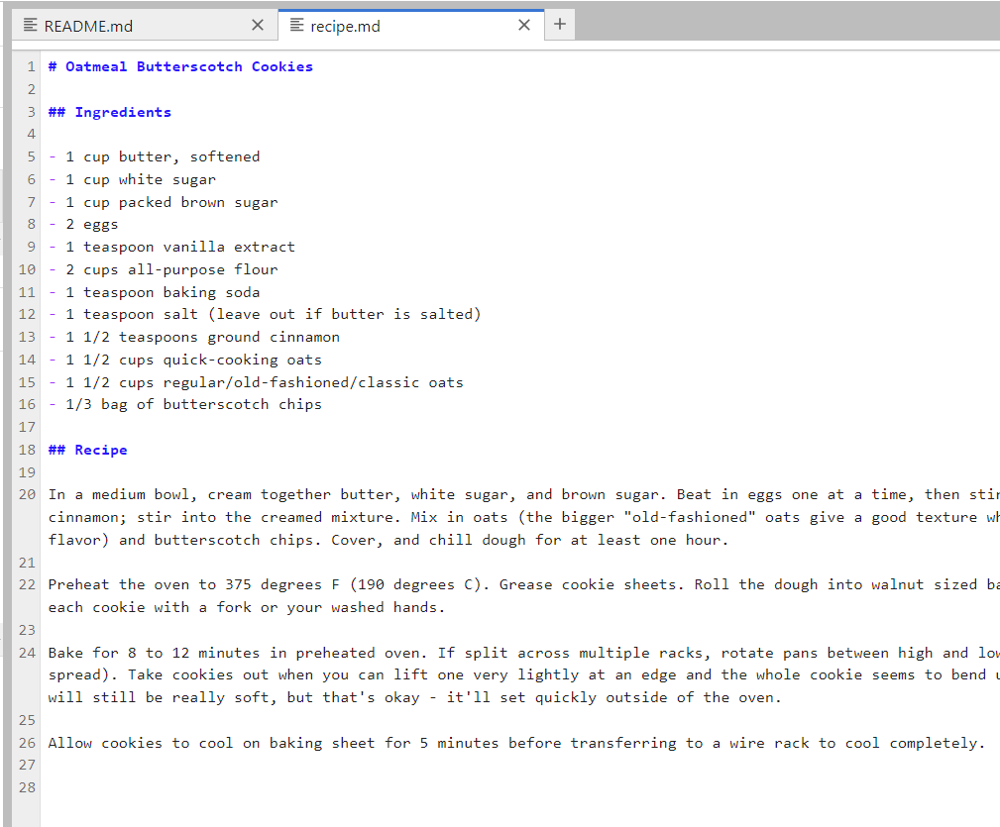

Add a new line to `README.md` mentioning it:

```plaintext
Name: Naomi Alterman
Favorite Song: "Under Pressure" by Queen
Favorite Food: Pizza
Favorite Animal: Oryctolagus cuniculus
Favorite Recipe: Oatmeal butterscotch cookies (see recipe.md for details)
```

Make sure to save all those files, and then return to the "Changes" tab of the git sidebar. Stage **both** the changes to your `README.md`, and also your new `recipe.md` file. Write a summary and commit!

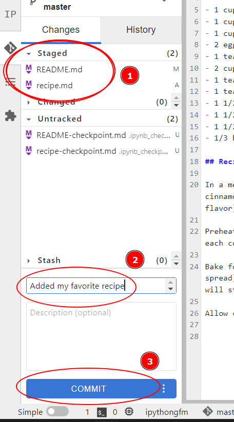

Now we have a journal folder containing our personal profile and our favorite recipe. We also have a timeline showing the development of that content over time.

To view the difference between two commits that _aren't_ next to each other in time, click the right-arrow button on the earlier commit (1) and the left-arrow button on the later commit (2). This will give you a list of files that changed between those two points in time. Click the diff button for the `README.md` (3):

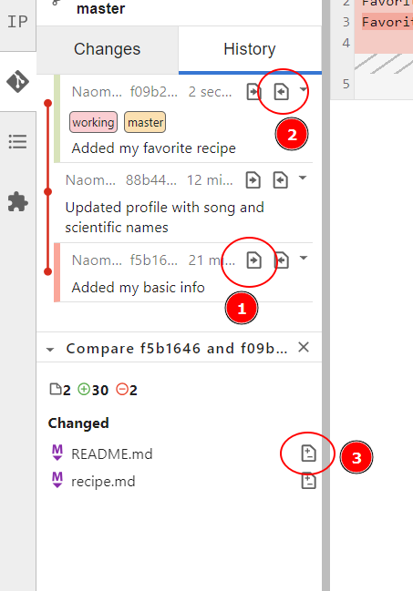

This will show us how the file evolved from the earlier point to the later point:

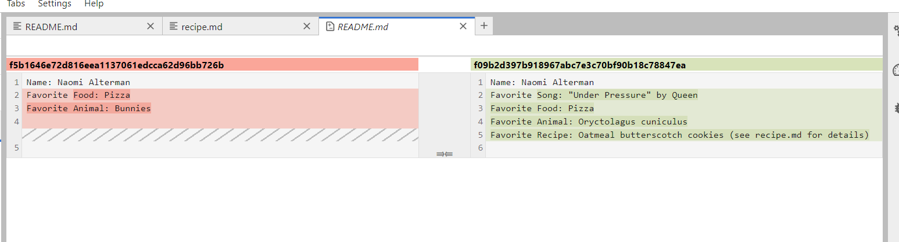

