# Introduction

TODO

# Setting up a lil journal

Make a new folder on desktop called 'my-journal'
Open it and make a new text file in it called 'readme.txt'
Open that in notepad/textedit

Type out some info about yourself, like this:

```bash
Name: Naomi Alterman
Favorite Food: Pizza
Favorite Animal: Bunnies
```

Save file.

But old versions will get lost!

# Turning our journal folder into a repository

Now, let's open Sublime Merge:

{}
🔗 [url](url)
{}

yep

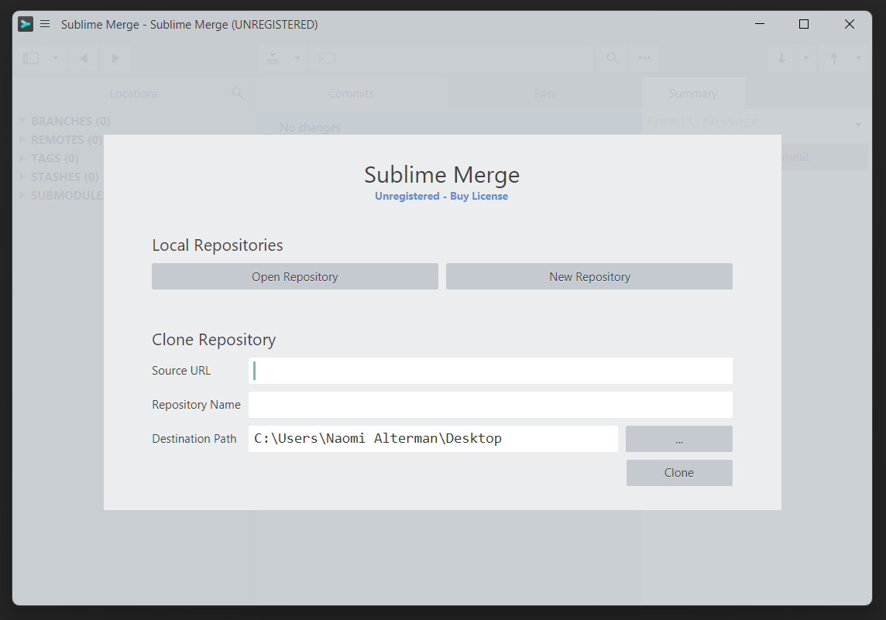

New Repository

Go to desktop, the `my-journal` folder. Click `Select Folder`

now our folder is a repository, and window looks like this:

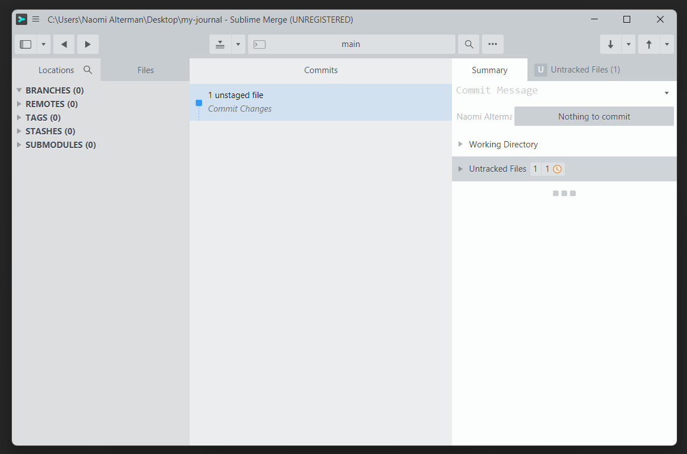

window layout:
- timeline in center, showing ordered history of all commits. 
- file detail in right - given selected commit, can see what changed (the diff)
- ignore left side for now


# Making our first commit


let's make our first commit, in which we'll mark the initial version of our user profile.

We'll start by **staging** the changes, which indicates to Git that we want to _include_ them in the next commit. Expand the list of "Untracked Files" (1), and then readme.txt (2). Note how this displays the contents of the file in green: these are the _changes_ in the file since the last commit, also called the *diff*. Since it's a new file, and this is our first commit, all of the file text is new and thus highlighted in green. To include this data in our commit, click the 'Stage' button (3):

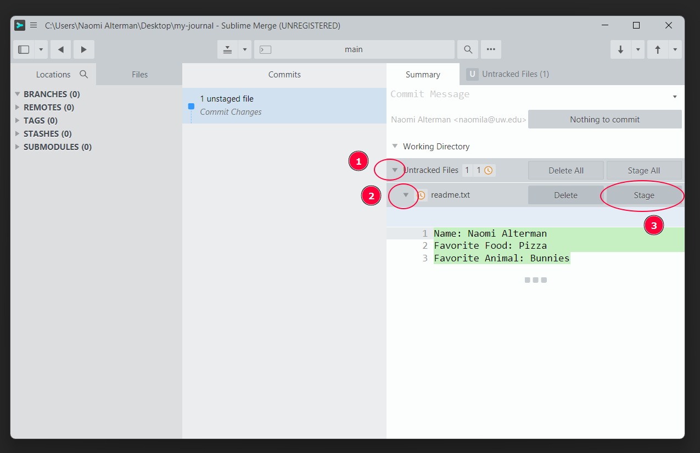

The summary tab will change, showing that instead of there being "untracked files", now there are "staged files". Write a commit message in the text box at the top of the summary tab indicating conceptually what these changes include (1), then click "Commit 1 file" (2): 

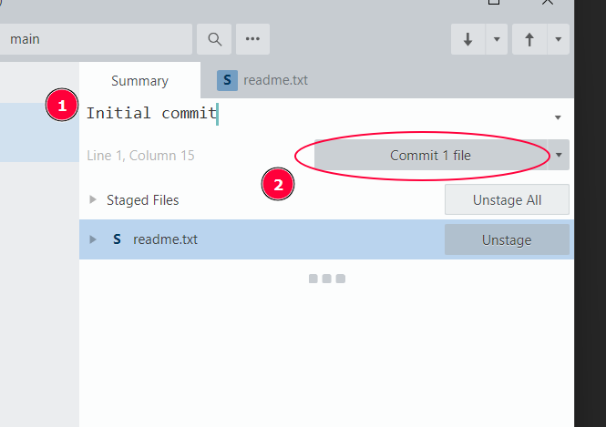

Our commit, and its message, will now appear in the center part of the window. If we select it with the mouse, we can see the changes to our files recorded at that point in time (in this case, the addition of our `readme.txt`):

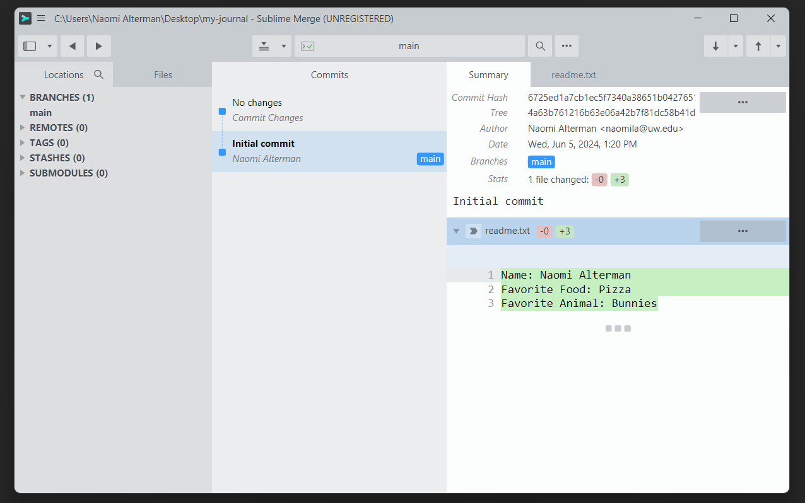

Notice the line in the summary labelled `Commit Hash`: the string of letters and numbers on this line, called a **hash**, serves as a unique name for this commit (that is, this set of changes to our files). Git tools (and git users) will often use commit hashes as "names" for specific points in the timeline. Insetad of including _all_ of the hash, it's often sufficient to just include 6 or 7 characters from the beginning (left side) of the hash. For example, the selected commit in the screenshot could be referred to as `commit 6725ed`.

# Using commits to record changes

Let's change our profile. Go over to your text editor and make a few changes:
- Add a new line in the middle of the file and specify your favorite song. 
- Replace your favorite animal's name with its taxonomic name (you may have to google it)


My profile now looks like this:

```bash
Name: Naomi Alterman
Favorite Song: "Under Pressure" by Queen
Favorite Food: Pizza
Favorite Animal: Oryctolagus cuniculus
```

Save the file and go back to Sublime Merge. Click the "unstaged file" entry at the top of the timeline to see your changes to the file in the diff panel:

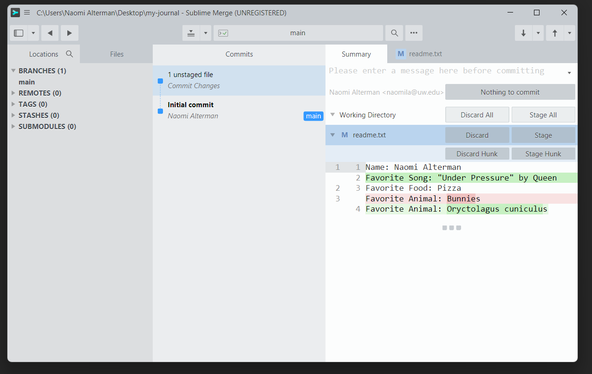

Click 'Stage' next to readme.txt to accept the changes. Then type a commit message out and commit the changes. Now we'll have two commits in our history:

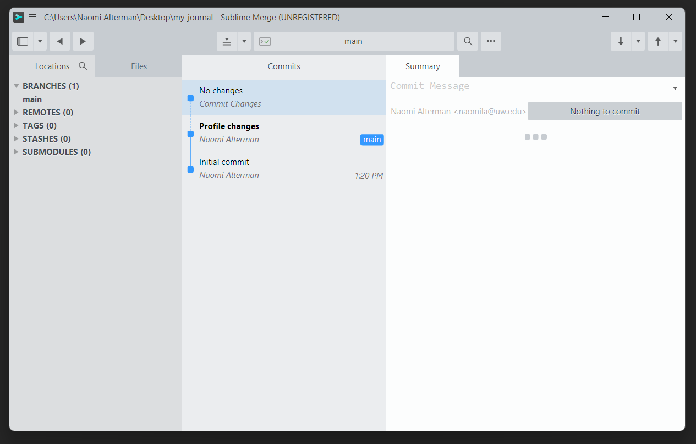

Let's add another file. Make another file in your journal folder called `recipe.txt` and paste your favorite recipe into it:

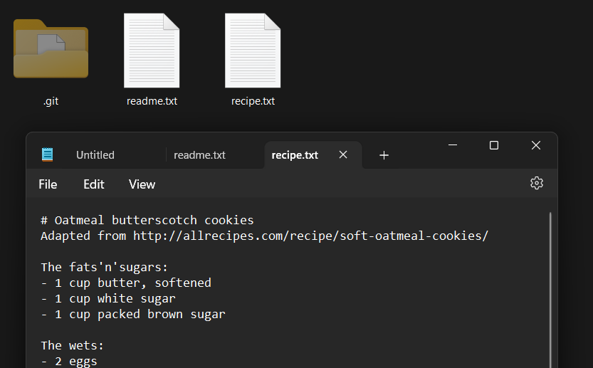

Add a new line to `readme.txt` mentioning it:

```bash
Name: Naomi Alterman
Favorite Song: "Under Pressure" by Queen
Favorite Food: Pizza
Favorite Animal: Oryctolagus cuniculus
Favorite Recipe: Oatmeal butterscotch cookies (see recipe.txt for details)
```

Make sure to save all those files, and then return to Sublime Merge. You'll see the changes to your `readme.txt` file, but the brand new file is currently hidden. To add it to the repository, expand the "Untracked Files" section at the bottom:

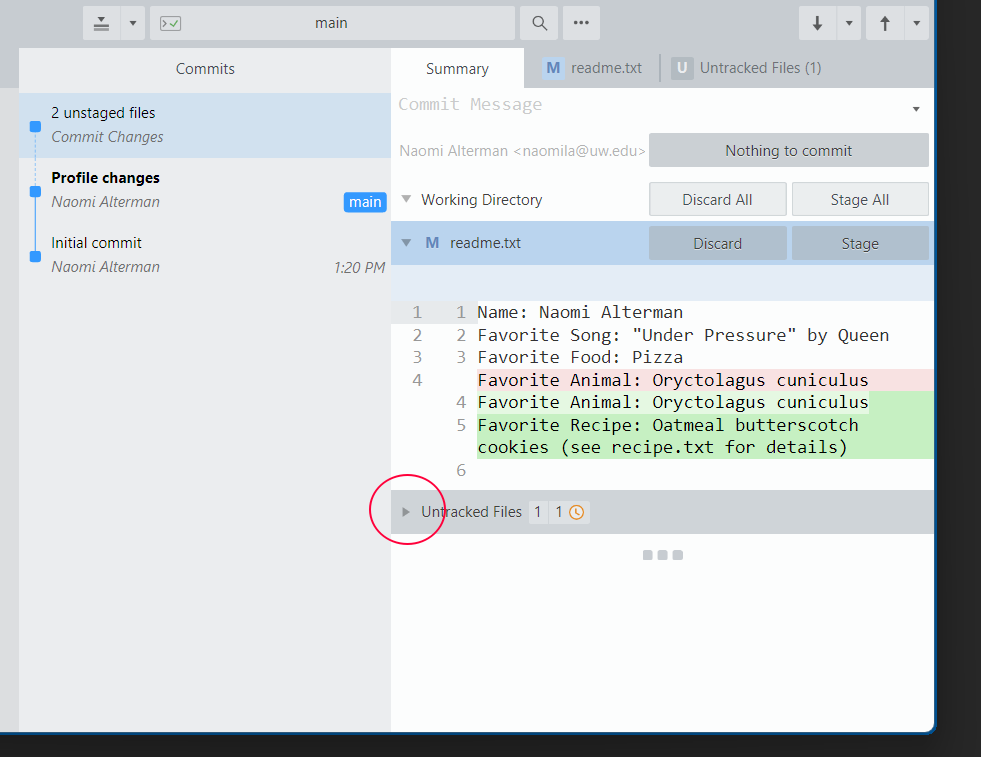

Click the "Stage" button on both `readme.txt` and `recipe.txt` to include both of them in our next commit:

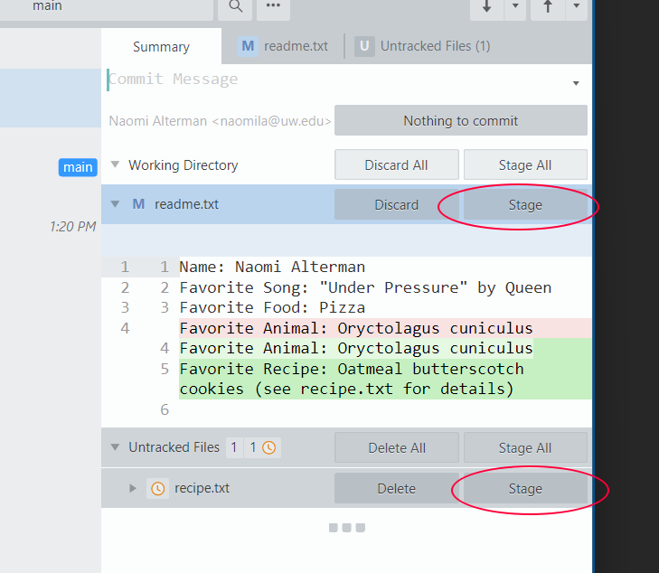

Now type out a commit message, and make the commit!

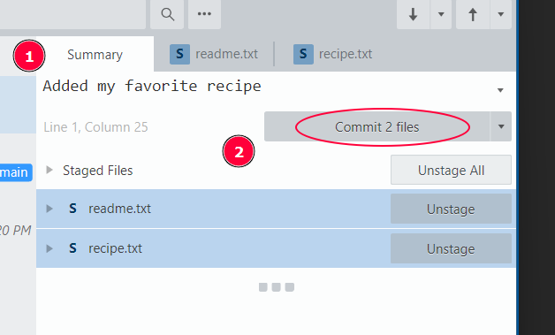

Now we have a journal folder containing our personal profile and our favorite recipe. We can click different commits in Sublime Merge's timeline view to see how those files changed over time:

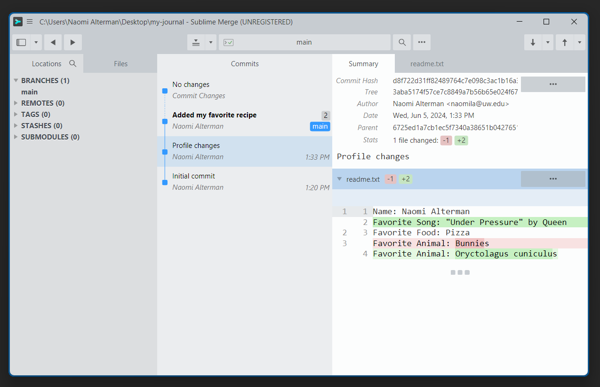

To view the difference between two commits that aren't next to each other in time, hold the control key and select the two commits you want to compare (TODO: command on mac?). Notice the `Diffing from` line in the summary, indicating the point in the timeline we're "comparing" against. Put another way: by selecting multiple commits, the diff view will show us all of the changes that happened between those points in the timeline:

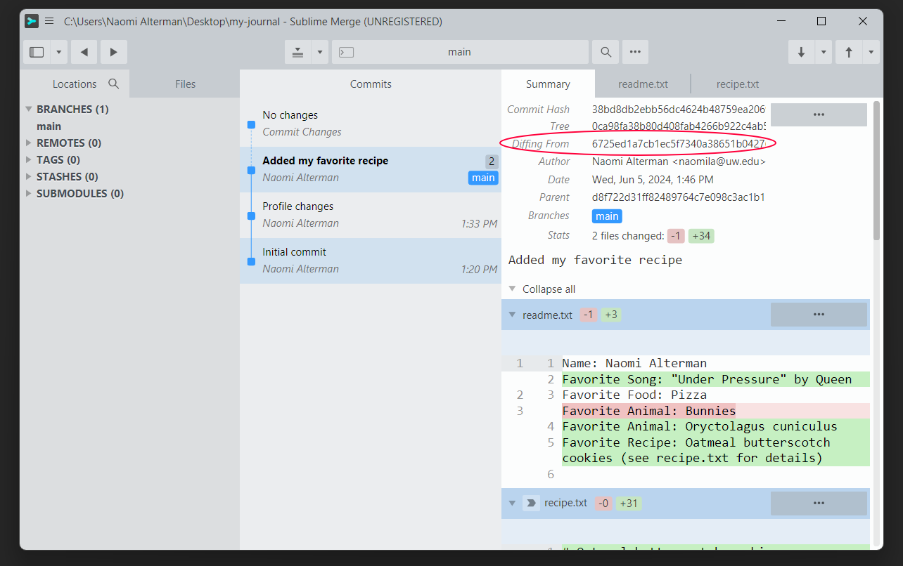

# Time-travelling with check-outs

Sublime Merge will let us browse the diffs at various points in time, but what if we want to open previous versions of our files in other applications, like Photoshop or VSCode?

We can use Git to "time-travel" all of the files back to a previous point in time by *checking out* a previous commit. In general Git jargon, the term *check out* means to make the contents of a file or set of files reflect their contents at the time a given commit was made:
- To "check out a commit" means to make all files in the repo reflect their contents at that commit's point in the timeline.
- To "check out a file" usually means to return a file to its present-day contents

Anyway, let's check out a previous commit.

Right-click the first commit in our timeline and select "Checkout Commit":

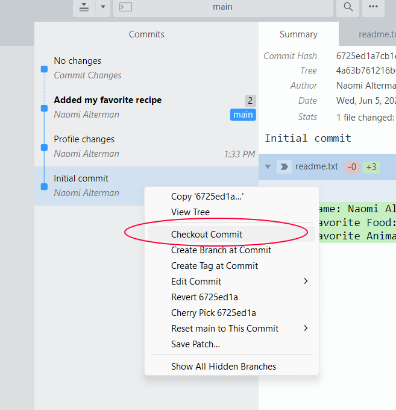

Sublime Merge will likely display a warning message about a "detached head", and the timeline view will change to look something like this:

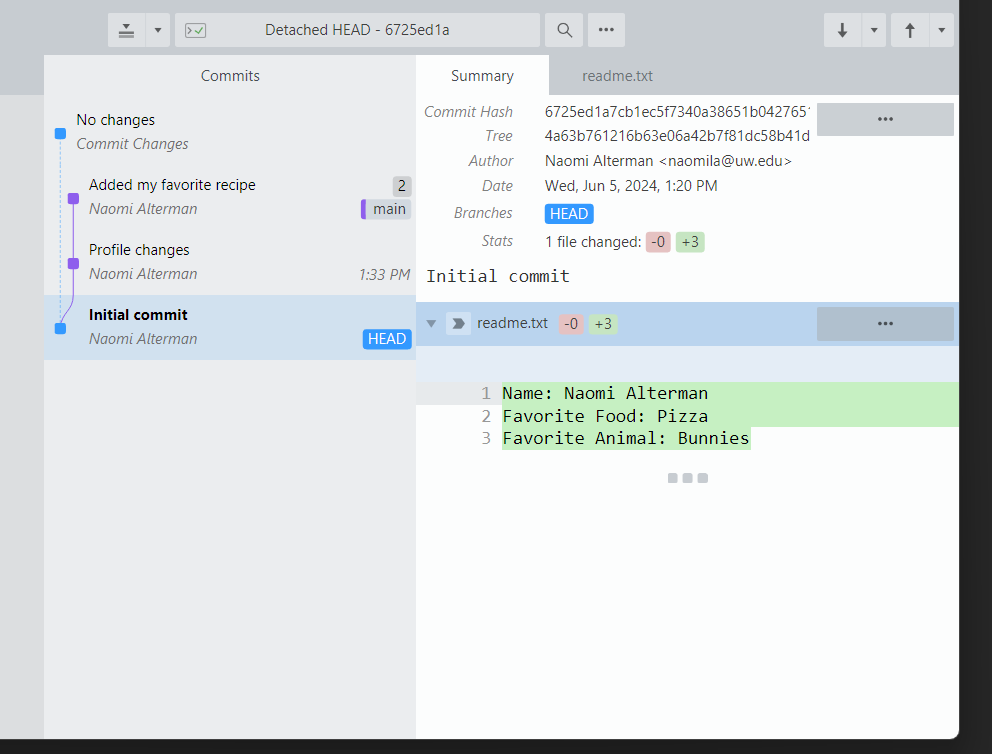

There is a lot going on here! Some things worth noticing:

- The `HEAD` label on the "Initial Commit" entry. This label refers to the point in the timeline we currently are "visiting". Usually, `HEAD` points to the most recent commit and is hidden from the timeline view. Because we've moved back in time, the label now appears to indicate this.

- There is a dotted line running from "Initial commit" to the top of the list, in parallel with all the other commits we made. This is a visual indicator that if we make any changes to our files now, they represent a _completely different timeline_ than the one we made our previous commits on.

- There is no name for this brave new timeline, and hence HEAD is "detached". Any changes and commits we make will get lost the next time we return to the main timeline, since we have no name to refer to them with. There are _proper_ ways to make changes on an alternate timeline, but we won't discuss them in this workflow.

As a rule, we don't check out a previous commit to make changes. We check it out to _view_ the previous state of our work. We'll talk about how to "undo" things in a bit.

All that discussion aside, open your journal folder and take a look:

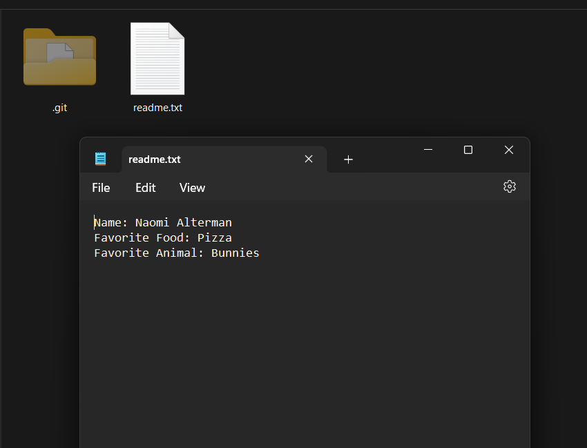

The `readme.txt` file reflects its contents from the beginning of our tutorial, and the `recipe.txt` file is completely missing! This is because, at the time of the checked-out commit, it didn't exist yet. Luckily it's not lost forever, though: it's stored safely in our repository's history (in this case, in commits that "will happen" in the "future", according to the main timeline).

Let's return to the present. In Sublime Merge, take a look at the left side of the window. The `Branches` list records all of the named timelines in our repository. Right-click `Main` and select `Checkout main`:

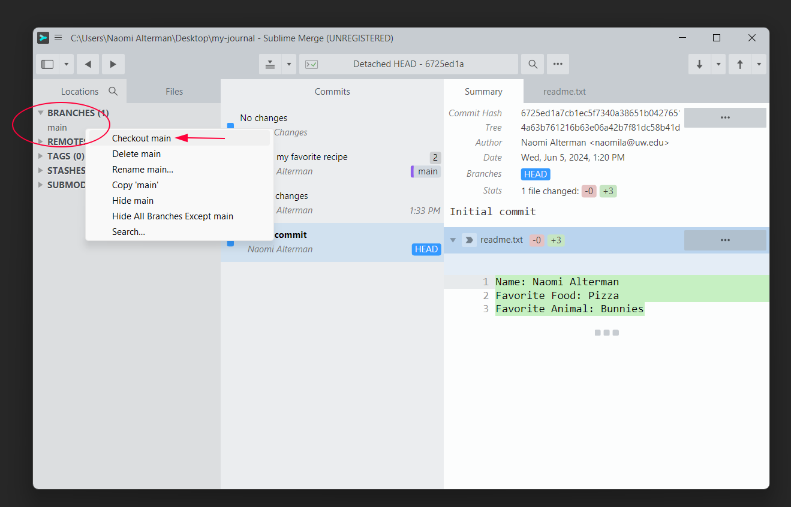

The timeline view should return to normal:

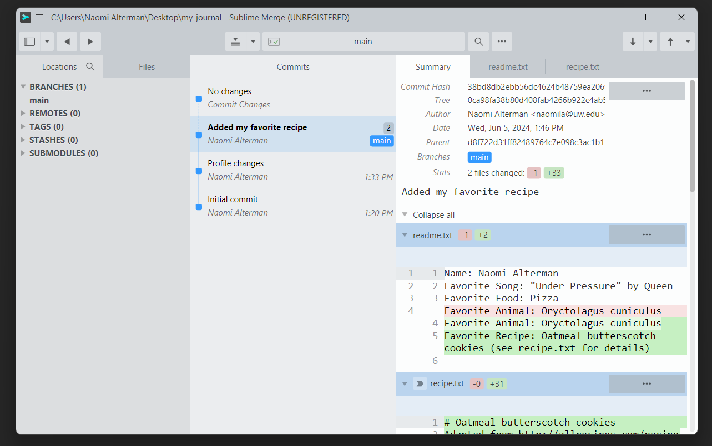

We've returned to the present. Take a look at your folder window, everything there should be back to normal too 😄.

# Undoing something from history

Let's say we made a mistaken change to our text in the past, and want to undo those changes. Git generally doesn't want us to alter the historical timeline. Instead, it'll have us make a _new_ commit that "undoes" the changes in the past we wish to remove. This is called a **revert**.

Let's say we want to _undo_ the contents of the second commit we made. That is, the commit that changed our favorite animal name to its taxonomic classification and listed our favorite song. We want to _keep_ our recipe around though -- we're just tired of scientific names we don't understand and old songs we don't want to hear anymore.

Right-click that second commit and choose "Revert":
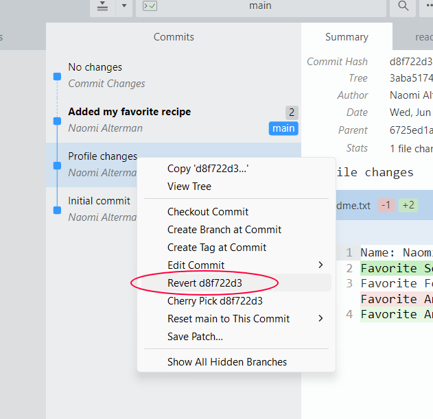

Uh oh! You'll see a message about a failure, and some new stuff will appear in the summary tab: 

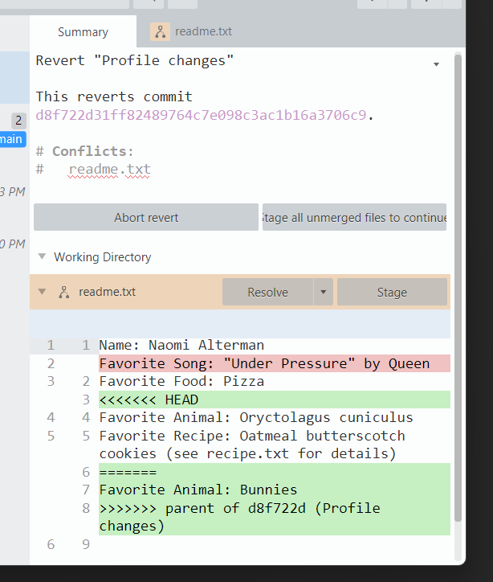

What happened was called a *conflict*: Git couldn't figure out how to make the changes we requested (fixing the animal line) without also screwing up some of the changes that happened later on (adding the recipe line). This is a common error to encounter, and very worth our while to get experience dealing with!

Whenever we encounter a conflict, we need to open the file in a text editor and _fix_ the conflicted portions of it. Those portions are labelled with a specific notation:

```python
<<<<<<< VERSION 1 LABEL
version 1 of the conflicting text
=======
version 2 of the conflicting text
>>>>>>> VERSION 2 LABEL
```

Wherever these angle brackets `<<<<<<< ... >>>>>>>` appear, they indicate two different versions of the same section of text, separated by the `=======`. Git couldn't choose between them, so it wants us to replace this conflicting section, including the angle brackets `<<<<<<< ... >>>>>>>`, with the version _we_ want. Maybe this is the top version. Maybe it's the bottom. Maybe it's some clever combination of the two.

For the rever we're working on, we want to keep the `Favorite Animal` line from the _bottom_ version, and the `Favorite Recipe` line from the top version. So let's open `readme.txt` in our text editor and replace the `<<<<<<< ... >>>>>>>` brackets and everything between them with the lines we want to keep:

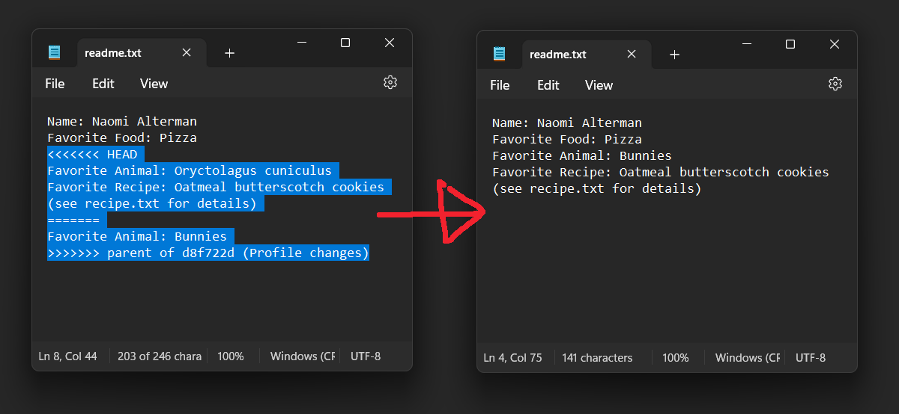

Save the file and return to Sublime Merge. Click the "Stage" button on `readme.txt` to include our changes in the upcoming revert:

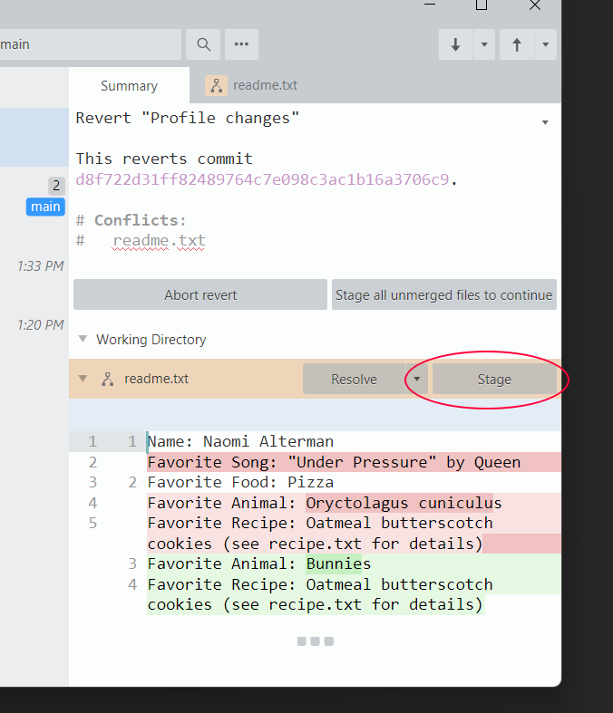

Finally, click the "Complete" button:

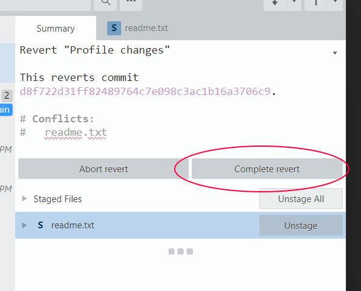

Our timeline will now include a new commit which "undoes" those changes we wanted to erase:

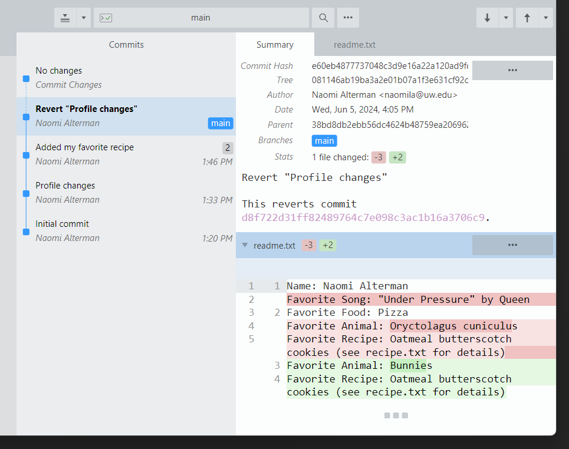

Hooray!


{}

⛔ **Git "resets"**⛔

You might have noticed another option when right-clicking to _reset main_ to a given commit. This **edits** the timeline so that it stops at the commit we are resetting to, and any commits that happened afterwards get **deleted**. This means we're **actually erasing history**, which is a very dangerous thing to do! In rare occasions it's the right choice, but you should always ask someone with more Git experience before actually doing it.

{}

# What next?

Your repository doesn't have to _just_ live on your computer -- it's possible to back it up to the cloud (or another computer, or multiple locations on your current computer) and keep the timelines consistent across all of them. We'll cover that in the next chapter.